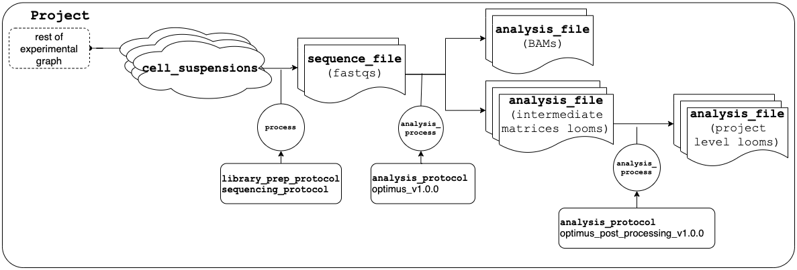

.. sectnum::
   :depth: 3
   :suffix: .

.. role:: raw-html(raw)
   :format: html
.. |nn| replace:: :raw-html:`<blockquote>`
.. |ne| replace:: :raw-html:`</blockquote>`

===================
DCP/2 System Design
===================

|nn| Text in a block quote (like this) is not normative. It was included for
informational purposes only and does not bear on the implementation. |ne|

.. contents::

Overview
========

The DCP/2 stores all (meta)data in the Terra Data Repository (TDR). The
metadata is indexed by Azul, the Data Browser back end, so that the Data
Browser front end can expose it for interactive discovery by end users. The
Data Browser facilitates the download of metadata (via Azul) and data (via
Azul and TDR's DRS 1.1 implementation) to end users' systems. The Data Browser
has a mechanism for handing off (meta)data for analysis in Terra.

(Meta)data is imported into the TDR from one or more staging areas whose
structure is specified in this document. The staging areas are prepared by so
called *adapters* and imported by an *importer*. There is an adapter for
(meta)data in DCP/1 (the *DSS adapter*), an adapter for primary (meta)data in
EBI Ingest (the primary channel for incorporating projects into the DCP/2), an
adapter for processing analysis (meta)data from Terra workspaces, and adapters
for high-level matrix data from a range of sources.

All metadata is in JSON format and complies with the `HCA Metadata Schema`_.
Changes to that schema are made according to standard `DCP/2 operating
procedures`_.

.. _HCA Metadata Schema: https://github.com/HumanCellAtlas/metadata-schema

.. _DCP/2 operating procedures: dcp2_operating_procedures.rst

The DCP/2 only contains public (meta)data (not controlled access).

The data in the DCP/2 is organized logically by *project* and physically by
*dataset*, *snapshot* and *catalog*. The term project was inherited from the
DCP/1 and it is used to group the (meta)data from a particular publication,
usually by a single laboratory or consortium of laboratories. Outside of the
DCP/2 a project is often referred to as a *study* or a *dataset* but the
latter term has a different connotation in the DCP/2.

Each component (Ingest, TDR, Azul, Data Browser) maintains at least two
instances: one for development, testing and integration with other components
(``dev``) and one for production (``prod``).

Datasets, snapshots and catalogs
--------------------------------

One TDR dataset includes all (meta)data to be released as part of the MVP.
Other datasets may be created for testing and demonstration. All 29 of the
DCP/1 projects are included in that dataset. So are any other projects listed
in these two tracker sheets: `Data Ops Tracker`_ and `Datasets for MVP HCA
DCP2`_. Multiple snapshots of the datasets may be created but only one
snapshot is displayed in the Data Browser. The official MVP snapshot must be
retained but earlier pre-release snapshots can and should be deleted.

.. _Data Ops Tracker: https://www.google.com/url?q=https://docs.google.com/spreadsheets/d/17zoW8zGEp_qnnjKY6KH2CUuX5ubVDE0SkOINMvUw6kI&sa=D&source=editors&ust=1614906832769000&usg=AOvVaw0yT5zSGVe3kIjTYcLyNZk0

.. _Datasets for MVP HCA DCP2: https://www.google.com/url?q=https://docs.google.com/spreadsheets/d/1ot-Xw-EaoCMxUxAVmXIWocx80hhmxa_g3StCEYH3oDo&sa=D&source=editors&ust=1614906832769000&usg=AOvVaw1-vdCuo2XvOy60fO7eB-rl

An instance of the Data Browser backend (Azul) supports multiple catalogs. A
catalog is a self-contained, independent index of a given TDR snapshot. The
Data Browser frontend is configured to display the contents of a particular
catalog by default and includes UI elements that allow the user to select a
different catalog to be displayed. In ``prod``, there are two catalogs:
``dcp1`` and ``dcp2``. The ``dcp1`` catalog contains

- all (meta)data from the DCP/1 datastore (DSS)

- project-level matrices generated by the DCP/1 Matrix Service for some
  projects with 10x experiments

The ``dcp2`` catalog contains work towards the next post-MVP release

- primary (meta)data from the DSS

- primary (meta)data for projects that were wrangled and ingested by EBI/UCSC
  but had not been placed into the DSS

- project-level matrices from other sources (also known as
  contributor-generated matrices), potentially stratified by species, organ,
  development stage and library construction (10x or SS2)

- a growing corpus of (meta)data produced by reanalysing ("re" as in again,
  in contrast to the analysis that was done by the DCP/2) the primary data in
  this catalog

- the matrices produced by that reanalysis, stratified by assay, species, and
  organ.

|nn| There is experimental support for indexing multiple, non overlapping
snapshots into a single catalog in the Data Browser. This will allow for the
creation of one snapshot per project which will allow for faster incremental
ingestion of primary (meta)data for new projects, faster indexing of
(re)analysis output and, last but not least, ingestion of projects containing
access controlled (meta)data. Even further down the road, this feature will
enable the creation and indexing of a snapshot per project and access control
domain, so that projects with a mix of public and access-controlled data, or a
mix of access control domains can be incorporated into the DCP/2. |ne|

Terra Data Repository schema
============================

For metadata, the Terra Data Repository (TDR) distinguishes between datasets
and snapshots. While a dataset is the primary storage for metadata over
multiple versions, snapshots are an immutable subset of a dataset containing
only some entities and only one version of those entities, typically, the
latest version at the time the snapshot is created. For data files, TDR uses
Firestore. Metadata entities that describe data files contain a reference to
the data file in Firestore. |nn| Both datasets and snapshots are currently
implemented as Google BigQuery datasets. The tables in the BigQuery dataset
that backs a TDR snapshot are currently views, not physical tables. |ne|

Metadata consumers query the BigQuery tables or views in a TDR snapshot using
the BigQuery SQL dialect. This is a very powerful means but comes with a
relatively steep learning curve. The REST web service exposed by Azul, the
Data Browser back end is a simpler but less powerful alternative that will
service most consumers' needs.

TDR datasets
------------

A TDR dataset is made up of one table per concrete HCA metadata entity type.
These entity types are defined in JSON schema, one schema per type. The JSON
schema source code is hosted on Github—each ``*.json`` file underneath `this
Github folder <metadata entities_>`_ defines a concrete HCA entity type. [#]_
Each row in a TDR table represents exactly one HCA entity. A *document* is a
metadata entity serialized as JSON, using one of the concrete schemas.

.. _metadata entities: https://github.com/HumanCellAtlas/metadata-schema/tree/master/json_schema/type

- The content of a document is stored verbatim (as a variable-length JSON
  string) in the ``content`` column of a row in the TDR table for entities of
  the type defined by that schema.

- The ``…_id`` primary key [#]_ (PK) column (e.g. ``cell_suspension_id``) of
  such a table holds the entity ID, a UUID. The entity ID can also be found in
  the ``content`` column under the ``provenance.document_id`` document path.

- The ``version`` PK column of each table is a BQ TIMESTAMP. An update to an
  entity manifests as a new row in the table. The new row has the same
  ``…_id`` but a strictly greater value in the ``version`` column. For
  entities imported from the DCP/1 datastore (DSS), this column is set to the
  version of the corresponding ``*.json`` metadata file in DSS.

- The TDR tables corresponding to `HCA schemas for data files`_ such as
  ``sequence_file``

  - have an additional ``FileRef`` column called ``file_id`` containing the
    DRS URI of the data file, [#]_

  - and a ``descriptor`` column, a variable-length JSON string containing the
    file descriptor JSON with properties for checksums, content type and the
    path of the data file (see `Generic file metadata`_).

- As required by TDR, each row has a ``rowid`` which is an auto-generated UUID
  assigned by the repo at the time of import.

.. _HCA schemas for data files: https://github.com/HumanCellAtlas/metadata-schema/tree/master/json_schema/type/file

There is currently no database schema migration support in TDR so tables can't
be created on demand by the importer. Instead, a table for every schema type
is created when the TDR dataset is created, even if there are currently no
instances of that schema in any of the staging areas to be imported. |nn|
Until the final MVP snapshot was released we had the freedom to erase all TDR
tables, recreate the TDR schema and rerun the importers. Post-MVP release,
this freedom is greatly restricted and we need to rely on schema migration in
TDR natively. |ne|

.. [#]
   Concrete schema types like `sequence_file`_ conceptually inherit an
   abstract schema type by `embedding`_ a core schema like
   `file_core`_.

.. _sequence_file: https://github.com/HumanCellAtlas/metadata-schema/blob/master/json_schema/type/file/sequence_file.json

.. _embedding: https://github.com/HumanCellAtlas/metadata-schema/blob/f37da4858d0a31263d2126246e552f45048cb87c/json_schema/type/file/sequence_file.json#L8

.. _file_core: https://github.com/HumanCellAtlas/metadata-schema/blob/master/json_schema/core/file/file_core.json

.. [#]
   Marking a column as PK in a TDR schema makes the column mandatory. BQ
   does not have a notion of primary keys and TDR only enforces the
   mandate but not uniqueness.

.. [#]
   Note that this column is different from the ``file_id`` property of
   the JSON value in the ``descriptor`` column

TDR snapshots
-------------

TDR snapshots follow the same schema except that the value in the ``file_id``
column is not null and that the ``…_id`` primary key column is unique i.e., no
two versions of the same entity.

Subgraphs in TDR (the links table)
----------------------------------

The rows in the TDR entity tables represent metadata entities, which can also
be regarded as vertices in the HCA metadata graph.

In the DCP/1 data store, the edges in that graph were defined in
``links.json`` files, one such file per bundle. Each ``links.json`` file
defined a *subgraph* of the overall metadata graph. The individual subgraphs
were self-contained (all entities in the subgraph are present in the bundle)
but not disjunct (some edges and entities are present in more than one bundle,
some in many bundles). To update a subgraph one had to create a new bundle,
complete with references to all entities and data files. To update an entity
one had to update all bundles referring to it. This was due to the bundle
referring to specific versions of each entity, even though ``links.json`` did
not. While DCP/1 bundles are extinct in DCP/2, the subgraphs as defined by
``links.json`` survive.

The TDR dataset uses a dedicated table to store individual subgraphs. The
table is called ``links`` and it contains a row for each subgraph. The columns
in that table are

- ``content``, which holds the content of ``links.json`` verbatim,

- ``project_id`` which is a foreign key (FK) into the ``project`` table,

- and a ``links_id`` PK column. A ``links_id`` identifies a subgraph. For new
  projects this is a newly allocated UUID identifying each subgraph. For
  projects imported from the DSS this is the UUID of each copied bundle. This
  is done to provide idempotence (ability to rerun the import without having
  to clear the TDR tables) and provenance (ability to trace data back from TDR
  to DSS).

- There is also a ``version`` PK column, a BQ TIMESTAMP. An update to a
  subgraph manifests as a new row. The new row has the same value in
  ``links_id`` as the original row and an increased value in ``version``. The
  two rows also differ in their ``rowid``. For links imported from the DSS, this
  column is set to the version of the bundle containing the corresponding
  ``links.json`` metadata file in the DSS.

TDR snapshots contain the same table, but just like entity tables in
snapshots, only one version of a subgraph may exist and the ``links_id``
column is a unique key for all rows in the ``links`` table of a snapshot.

Subgraph reconstruction
~~~~~~~~~~~~~~~~~~~~~~~

In order for metadata consumers to be able to reconstruct the HCA metadata
subgraphs from the contents of a TDR dataset or snapshot, the schema for
``links.json`` was updated so that each reference from a link to a process,
input or output is qualified with the concrete type of the entity, enabling
metadata consumers to identify the name of the table from which to read the
respective process, input or output. Under the revised schema, an example
entry in ``links.json`` looks as follows::

    {
        "process_id": "b7a172d6-dbb1-41f3-8ae4-7807e1eca803", # renamed from process!!!
        "process_type": "analysis_process",
        "inputs": [
            {
                "input_type": "sequence_file",
                "input_id": "6f725a94-5c81-45e5-8d16-96520aa99703"
            }
        ],
        "outputs": [
            {
                "output_type": "analysis_file",
                "output_id": "2e072336-b906-4c9b-a475-ca03f51c8452"
            }
        ],
        "protocols": [
            {
                "protocol_type": "analysis_protocol",
                "protocol_id": "4d6f7580-ce81-4a81-9c2c-872fcb23b7cd"
            }
        ]
    }

The steps to reconstruct a subgraph from the tables in a TDR *dataset* are as
follows:

1.  Given a ``links_id`` (the UUID of a subgraph) and ``version``, fetch the row
    with that ``links_id`` and ``version`` from the ``links`` table.

2.  Read that row's ``content`` column and iterate over the items of the
    ``links`` property (a list) of the JSON document in ``content``.

    For each item aka link,

    i.  read the ``process`` property, and extract the schema type from the
        ``process_type`` property and the process UUID from the
        ``process_id``. Query the TDR table that corresponds to the schema
        type and fetch all rows where ``{schema_type}_id`` equals the process
        UUID. Pick the row with the highest version.

    ii. read the ``inputs``, ``outputs`` and ``protocols`` properties (they're
        all lists).

        For each input, output and protocol, extract the schema type and
        entity ID. Query the TDR table that corresponds to the schema type and
        fetch all rows where ``{schema_type}_id`` equals the entity ID. Pick
        the row with the highest version.

The steps to reconstruct a graph from a TDR *snapshot* are the same, except
that there is only one row per entity UUID (only one version of that entity)
and only one row per ``links_id`` (only one version of that subgraph). The
reconstruction should fail if multiple versions are found.

Subgraph stitching
~~~~~~~~~~~~~~~~~~

|nn| One architectural point of contention in DCP/1 was the fact that analysis
bundles included all the (meta)data from the input bundle. This redundancy was
one of the reasons the design of the metadata update mechanism became so
complicated and was never finished. |ne|

When Azul indexes an analysis subgraph it needs to associate the analysis
files in that subgraph with the properties of the biomaterial metadata
entities in the subgraph that contains the input sequence files. Without this,
the analysis files wouldn't be discoverable in the Data Browser by, say, the
species, a property of the ``donor_organism`` entity, or the assay, a property
of the ``library_preparation_protocol`` entity.

Azul looks for dangling edges in an analysis subgraph, that is, entities that
occur as an input to an analysis process but that are not contained in the
analysis subgraph. For each dangling edge, Azul queries the ``links`` table
for subgraphs containing processes that have these entities as outputs. It
loads all matching subgraphs, connects them to the analysis subgraph and
repeats the process until no more dangling edges exist. Azul then indexes the
resulting stitched subgraph as it would any other subgraph.

|nn| To summarize, Azul dynamically builds a self-contained subgraph that
resembles the DCP/2 analysis bundle, but without needing to redundantly
persist the result, thereby eliminating a complicating factor for metadata
updates. The downside is that consumers of the raw metadata in TDR would also
have to stitch subgraphs in order to get a complete, self-contained analysis
subgraph. One mitigation would be for Azul to store the all subgraphs
(stitched analysis subgraphs as well as primary subgraphs) verbatim in its own
index and expose them for access via its REST API. This would eliminate not
only the need for consumers to stitch subgraphs, but also the need to learn
BigQuery and the TDR schema. |ne|

Supplementary files
-------------------

… in DCP/1 were not linked as part of ``links.json``. Their mere presence in a
bundle associated them with the project. There are no bundles in DCP/2 so, the
schema for ``links.json`` has been refactored to accommodate a new type of
``supplementary_file_link``, in addition to the existing ``process_link``.
This new type of link is used to associate an entity (currently only those of
type `project`_) with a `supplementary_file`_. The DSS adapter scans each
bundle for supplementary files and adds links to ``link.json`` accordingly.

.. _project: https://github.com/HumanCellAtlas/metadata-schema/blob/master/json_schema/type/project/project.json

.. _supplementary_file: https://github.com/HumanCellAtlas/metadata-schema/blob/master/json_schema/type/file/supplementary_file.json

Generic file metadata
---------------------

The bundle manifest entries in the DCP/1 datastore (DSS) contain certain data
file properties that aren't captured anywhere else. Because of the absence of
bundles in DCP/2, these properties are instead stored in a *file descriptor*,
as defined by the `file_descriptor.json`_ schema in the ``system`` directory
of the metadata-schema repository. The DSS adapter and EBI Ingest Exporter
adapter create a file descriptor for each data file in a staging area. These
file descriptors are objects underneath the ``descriptors`` directory of the
staging area.

.. _file_descriptor.json: https://github.com/HumanCellAtlas/metadata-schema/blob/master/json_schema/system/file_descriptor.json

TDR stores the descriptor verbatim in the ``descriptor`` column of each
``…_file`` table in the TDR dataset.

An example file descriptor follows below::

    {
        "describedBy": "https://schema.humancellatlas.org/system/1.0.0/file_descriptor",
        "schema_version": "1.0.0",
        "schema_type": "file_descriptor",
        "file_name": "1b6d8348-d6e9-406a-aa6a-7ee886e52bf9/IDC9_L004_R2.fastq.gz",
        "size": 4218464933,
        "file_id": "ae5d1035-8f2b-4355-a0ef-bbb99958b303",
        "file_version": "2020-05-01T04:26:07.021870Z",
        "content_type": "application/gzip",
        "crc32c": "0b83b575",
        "sha1": "9ee5c924eb8cce21b2544b92cea7df0ac84e6e2f",
        "sha256": "4c9b22cfd3eb141a30a43fd52ce576b586279ca021444ff191c460a26cf1e4cc",
        "s3_etag": "c92e5374ac0a53b228d4c1511c2d2842-63"
    }

- The ``file_name`` property is the object name of the data file relative to
  the staging area’s data/ directory . It may contain slashes but must not
  start or end in a slash. An adapter is free to choose whatever naming system
  for data files it deems appropriate. Note that this permits naming schemes
  that use content addressing for deduplication. The DSS adapter uses the
  bundle UUID (same as ``links_id``) and the ``file_name`` property of a
  file's entry in the bundle manifest to determine the value for
  ``file_name``. [#]_

- ``file_id`` is a UUID that uniquely identifies each data file in the source.
  The DSS adapter, for example, uses the DSS file UUID for ``file_id``. This
  is not the same as the ``file_id`` columns in the TDR tables for metadata
  entities describing data files since they are FireStore references specific
  to TDR). Typically, the ``file_id`` in descriptors is also different from
  the ``…_file_id`` (``sequence_file_id`` or ``analysis_file_id``, for
  example) columns of those tables since those columns identify the metadata
  entity describing the data file, not the data file itself.

- The ``file_version`` field uses the same syntax as in object names for
  metadata entities. It denotes the version of the datafile. The DSS adapter
  uses the DSS file version for this.

- ``content_type`` is an appropriate MIME type of the data file's content. It
  should be consistent with the value of the Content-Type header an HTTP
  server would use when serving the data file.

- ``crc32c``, ``sha1``, ``sha256`` and ``s3_etag`` are the respective hashes
  of the content. Note that the schema only permits lowercase hexadecimal
  characters to avoid ambiguity. [#]_ As opposed to the other hashes, the S3
  ETag does not unambiguously represent a particular data file content. There
  can be many different S3 ETags for the same sequence of bytes.

The name of a descriptor object in a staging area is derived from the
identifier of the metadata entity describing the data file, i.e. the value
that ends up in the ``…_file_id`` column (``sequence_file_id`` or
``analysis_file_id``, for example) of the corresponding TDR entity table. For
details, see `Data exchange format`_.

If no ``file_id`` is defined organically for data files, it is recommended to
only allocate a random UUIDv4 for the ``file_id`` in the descriptor and derive
another UUIDv5 from that UUIDv4 for the ``…_file_id`` of the metadata entity.
This has the advantage of being deterministic without requiring a persistent
mapping between the two. Similarly, instead of allocating a random UUIDv4 for
the descriptor ``file_id`` one could also derive a UUIDv5 from the SHA-1 or
SHA-256 hashes of the data file's content.

.. [#]
   If a file is referenced by multiple bundles using different file names, the
   DSS adapter stages multiple objects with the same content. This case occurs
   in the wild, but is of negligible impact (< 1% in volume, zarr store
   members and PDFs documenting experimental protocols).

.. [#]
   many developers erroneously compare the string representation of content
   hashes (and UUIDs for that matter) using a case sensitive quality
   comparison

Analysis provenance
-------------------

In DCP/1, an analysis bundle (a bundle containing output files from an
analysis workflow) referred to the input bundle (a bundle that contains the
input files) via the `input_bundles`_ property of the ``analysis_process``
entity. [#]_ This was problematic in two ways: 1) the bundle version is
missing and 2) metadata should be agnostic to bundles. The
``analysis_process`` schema also requires a ``reference_bundle`` property for
specifying the bundle that contains the reference files. This property also
suffers from the same problems. The two properties of an ``analysis_process``
entity and the ``links.json`` files are the only places where metadata
mentions bundles in DCP/1.

.. _input_bundles: https://github.com/HumanCellAtlas/metadata-schema/blob/f37da4858d0a31263d2126246e552f45048cb87c/json_schema/type/process/analysis/analysis_process.json#L184

To solve both problems, the ``analysis_process`` schema was revised to instead
list references to the metadata entities that describe the individual
reference data files in a property called ``reference_files``. The
``input_bundles`` and ``reference_bundle`` properties were removed. Note that
an entry in ``reference_files`` does not directly reference a data file, but
instead references the metadata entity that describes the data file.

|nn| After MVP we should consider moving the ``reference_files`` property to
the ``analysis_protocol`` entity or model the reference files as regular input
files to an ``analysis_process`` in the ``links`` table (`metadata-schema
#1288`_). |ne|

.. _metadata-schema #1288: https://github.com/HumanCellAtlas/metadata-schema/issues/1288

.. [#]
   While the schema allows multiple input bundles, the analysis bundles in the
   wild only have one.

Naming datasets and snapshots
-----------------------------

|nn|

This section contains specific details that anticipate that the DCP/2
will soon need to support multiple snapshots of per catalog, at least one per
project, potentially more than one per project. When it was written, TDR did
not have the ability to sort the snapshot/dataset listing or associate
additional metadata with datasets/snapshots aka "labeling". There are two
motivations why we needed a consistent naming scheme for datasets and
snapshots:

1. There exist uniqueness constraints on snapshots: For example, there should
   only be one "active" snapshot per TDR deployment and HCA project. If there
   are multiple snapshots in the same deployment for the same project their
   creation date should disambiguate and order them, such that it is obvious
   which of them is the latest one. A naming scheme, if followed, helps with
   that, especially in the absence of TDR features like labeling and sorting,
   and enforcing these uniqueness constraints.

2. Not having a naming scheme means that names will be arbitrary and
   ultimately confusing. **If** names are used, the names should be chosen
   systematically. The only alternative to using names that follow a scheme is
   to ignore names altogether and use UUIDs instead. But this requires that
   labelling, sorting and filtering are available when listing datasets and
   snapshots using the TDR API. Additionally, IDs are hard to read to the
   human eye, and hard to distinguish visually, so as long as we manually
   confer them between teams, names are preferred.

|ne|

Grammars below use a mix of `EBNF`_ and regular expressions. They are designed
to be easily parsed, either using regular expressions or by splitting on
underscore, and so that a lexicographical sorting reflects both the
hierarchical relationship between datasets and snapshots as well as the time
they were created. ::

    dataset_name = "hca_" , deployment , "_" , creation_date , ["_" , qualifier]

    snapshot_name = dataset_name , "_", [project_id], "__" , creation_date , ["_" , qualifier]

.. _EBNF: https://en.wikipedia.org/wiki/Extended_Backus%E2%80%93Naur_form

Note that snapshots names contain two dates: one denotes the creation of the
dataset, the other that of the snapshot. The two consecutive underscores are
not a typo, they exist to facilitate access controls in the future. If
``project_id`` is omitted, there will be three consecutive underscores in the
name. ::

    creation_date = year , month , day

    year = [0-9]{4}

    month = [0-9]{2}

    day = [0-9]{2}

    qualifier = [a-zA-Z][a-zA-Z0-9]{0,13}

    deployment = "dev" | "staging" | "prod"

    project_id = [0-9a-f]{8}(-[0-9a-f]{4}){3}-[0-9a-f]{12}

The following regex can be used to validate dataset names::

    ^hca_(dev|prod|staging)_(\d{4})(\d{2})(\d{2})(_[a-zA-Z][a-zA-Z0-9]{0,13})?$

To validate snapshots (line breaks added for legibility)::

    ^hca_(dev|prod|staging)_(\d{4})(\d{2})(\d{2})(_[a-zA-Z][a-zA-Z0-9]{0,13})?
    _([0-9a-f]{8}(?:-[0-9a-f]{4}){3}-[0-9a-f]{12})?
    __(\d{4})(\d{2})(\d{2})(?:_([a-zA-Z][a-zA-Z0-9]{0,13}))?$

To validate either (line breaks added for legibility)::

    ^hca_(dev|prod|staging)_(\d{4})(\d{2})(\d{2})(_[a-zA-Z][a-zA-Z0-9]{0,13})?
    (?:_([0-9a-f]{8}(?:-[0-9a-f]{4}){3}-[0-9a-f]{12})?
    __(\d{4})(\d{2})(\d{2})(?:_([a-zA-Z][a-zA-Z0-9]{0,13}))?)?$

The longest possible snapshot name in this scheme is 97 characters::

    hca_staging_20200812_a1234567890123_9654e431-4c01-48d5-a79f-1c5439659da3__20200814_a1234567890123

Dataset examples::

    hca_dev_20200812
    hca_dev_20200812_dssAllNoData
    hca_dev_20200812_ebi
    hca_dev_20200812_dssPrimaryOnly

Snapshot examples::

    hca_dev_20200812_dssPrimaryOnly___20200813
    hca_dev_20200812_dssPrimaryOnly___20200814_fixedUnicode

Data exchange format
====================

The `Terra Data Repository schema`_ is in use for (meta)data migrated from the
DCP/1 datastore (DSS) as well as (meta)data for new projects from EBI Ingest.
Ad-hoc scripts could have been used to push the data from a source directly
into TDR but to further standardize the imports, the import process is split
into two phases, with (meta)data staged in a folder in a GCS bucket in between
these phases. This folder is referred to as a *staging area*.

The content of a staging area follows a standardized exchange format. A
staging area is defined by a URI of the form ``gs://{bucket}/{prefix}``. The
prefix must either be empty or end in a slash if it is not.

In the first phase, a source-specific *adapter* process pulls the (meta)data
files from the source, optionally pre-processes or transforms them, and
finally deposits them in the staging area.

In the second phase, an *importer* program pushes the data from the staging
area into TDR.

|nn| This design has the advantage that the code for interacting with TDR only
needs to be written once, simplifying the implementation of the various
adapters. It also allows the data to be staged incrementally and to be
validated prior to the actual import. Using a GCS bucket for staging areas
makes it possible to utilize GCP's cheap copies for the DSS adapter. |ne|

One bucket may contain multiple areas, from the same source or from a range of
sources. A staging area may contain (meta)data from multiple HCA projects, or
just one. If a staging area contains (meta)data for only one project, its
``prefix`` must end in ``{project_id}/``. There may be more than one staging
area for a given HCA project (for different deployments, for example) but each
one should be complete (cover the entire project) and no two staging areas for
the same project should ever be imported into the same TDR dataset.

For new DCP/2 datasets wrangled by EBI/UCSC, each project is treated as one
source and has its own staging area. All staging areas for such projects
appear in the staging bucket under a common folder.

Staging area layout
-------------------

Object names given in this section are relative to the staging area. To
produce the complete ``gs://…`` URI of a particular object in the staging
area, append the object's name to the staging area URI. [#]_

Staging area properties
~~~~~~~~~~~~~~~~~~~~~~~

Every staging area must include an object named ``staging_area.json`` in the
root directory. It contains a JSON object that defines the *staging area
properties* i.e. traits that apply to the staging area as a whole. Absence of
this object must result in an immediate abort of the importer with an error
message as defined in `Import errors`_. Legacy staging areas must be
retrofitted with this object before they can be imported again.

|nn| In this case, retrofitting seemed easier than defining defaults for each
and every staging area property going forward. Similarly, as we add staging
area  properties in the future, legacy staging areas would need to be
retrofitted again with those new properties, but I feel it's a good thing that
staging area sources are forced to make a concsious choice about the value of
each new staging area property before their staging area can be imported
again. |ne|

The contents of ``staging_area.json`` must match the following schema::

   {
     "$schema": "https://json-schema.org/draft/2019-09/schema",
     "properties": {
       "is_delta": {
         "type": "boolean"
       }
     },
     "required": [
       "is_delta"
     ],
     "additionalProperties": false
   }

The ``is_delta`` property indicates whether a staging contains exclusively
altered (added, deleted or updated) (meta)data. The specifics are defined in
`Altering data and metadata`_ and `Types of data and metadata alterations`_.

Object naming
~~~~~~~~~~~~~

There are four object naming schemes, one for data files, one for file
descriptors, one for metadata files and one for subgraphs.

- The object name of a metadata entity is::

    metadata/{entity_type}/{entity_id}_{version}.json[.remove]

  where

  ``entity_type``
    is the `HCA schema entity type`_ such as ``cell_suspension``.

  ``entity_id``
    is a UUID that uniquely identifies the metadata entity. [#]_ The TDR
    importer uses ``entity_id`` as the PK for the row in the corresponding BQ
    table e.g., the ``cell_suspension_id`` column of the ``cell_suspension``
    table.

  ``version``
    is an ISO timestamp with the ``Z`` suffix for UTC and a six-digit number
    of microseconds left-padded with leading zeros if necessary, e.g.,
    ``2020-05-01T04:26:07.021870Z``. Not every ISO syntax is supported, only
    those that match the regex::

      \d{4}-\d{2}-\d{2}T\d{2}:\d{2}:\d{2}\.\d{6}Z

    To avoid ambiguous string representations of the same version timestamp,
    the ``Z`` suffix is mandated and the microseconds field can't be omitted.
    Whole seconds must be specified as ``.000000``. The DSS adapter uses the
    DSS version of the metadata file, converting it to this restricted ISO
    syntax.

   Entity objects that share a given ``entity_id`` in a staging area must all
   have the same ``entity_type``. This precludes assigning the same
   ``entity_id`` to entities of different types, but allows several versions
   of one entity to coexist in a non-delta staging area. A delta staging area,
   on the other hand, must contain at most one object with a given
   ``entity_id``, and therefore only one version of that entity.

   The ``.remove`` suffix is used to request the removal of an entity. It can
   only be used in staging areas that have the ``is_delta`` property set to
   ``true``. If an object has this suffix, it must have a size of zero bytes.

.. _HCA schema entity type: https://github.com/HumanCellAtlas/metadata-schema/tree/master/json_schema/type

- The object name of a file descriptor is::

    descriptors/{entity_type}/{entity_id}_{version}.json[.remove|.delete]

  where ``entity_type``, ``entity_id`` and ``version`` have the same meaning
  as for metadata entities, except that the value of ``entity_type`` has to
  end in ``_file``. File descriptors are JSON documents and are described in
  `Generic file metadata`_.

   The ``.remove`` suffix is used to request the removal of a data file. It
   can only be used in staging areas that have the ``is_delta`` property set
   to ``true``. If an object has this suffix, it must have a size of zero
   bytes.

   The ``.delete`` suffix is used to request the deletion of a data file. It
   can only be used in staging areas that have the ``is_delta`` property set
   to ``true``. If an object has this suffix, it must have a size of zero
   bytes.

   For details on deletions and removals see `Types of data and metadata
   alterations`_.

   A staging area may only contain exactly one descriptor object with a given
   ``entity_id``. This precludes more than one version of any descriptor or
   assigning the same ``entity_id`` to descriptors for file entities of
   different types.

   Descriptor objects that share a given ``entity_id`` in a staging area must
   all have the same ``entity_type``. A delta staging area may contain at most
   one object with a given ``entity_id``.

- The object name of a data file is::

    data/{file_name}

  where

  ``file_name``
    is the ``file_name`` property from the file descriptor object for this
    data file.

- The object name for subgraphs is::

    links/{links_id}_{version}_{project_id}.json[.remove]

  where

  ``links_id``
    is a UUID that uniquely identifies the subgraph. The DSS adapter uses the
    bundle UUID.

  ``version``
    field uses the same syntax as in object names for metadata entities. It
    denotes the version of the subgraph. The DSS adapter uses the DSS bundle
    version.

  ``project_id``
    field identifies the project the subgraph is part of. A subgraph is part
    of exactly one project. The ``project_id`` field is at the end of the
    object path so that the importer, using a prefix query, can look up
    subgraph objects by their ID without knowing the project ID. The importer
    must record an error if it detects more than one object with the same
    ``links/{links_id}_{version}_`` prefix.

   The ``.remove`` suffix is used to request the removal of a subgraph. It can
   only be used in staging areas that have the ``is_delta`` property set to
   ``true``. If an object has this suffix, it must have a size of zero bytes.
   See `Types of data and metadata alterations`_ for details.

   A staging area may only contain exactly one subgraph object with a given
   ``links_id``. This precludes more than one version of any subgraph or
   using the same ``links_id`` in subgraphs for different projects.

   Subgraph objects that share a given ``links_id`` in a staging area must all
   have the same ``project_id``. This precludes assigning the same
   ``links_id`` to subgraphs for different projects, but allows several
   versions of one subgraph to coexist in a non-delta staging area. A delta
   staging area, on the other hand, must contain at most one object with a
   given ``links_id``, and therefore only one version of that subgraph.

.. [#]
   The staging area URI is guaranteed to end in a slash.

.. [#]
   The entity ID can also be found in each document under
   ``.provenance.document_id``.

Data file paths
---------------

Metadata entities that are instances of the `HCA schema types for describing
data files`_ refer to their corresponding data files using the
`file_core.file_name`_ property. This property contains a file path, not a
unique identifier. In DCP/1, that path to a data file is interpreted relative
to the bundle referencing the data file. That's actually the only means in
DCP/1 by which a data file is connected to the metadata file describing it.

.. _HCA schema types for describing data files: https://github.com/HumanCellAtlas/metadata-schema/tree/master/json_schema/type/file

.. _file_core.file_name: https://github.com/HumanCellAtlas/metadata-schema/blob/master/json_schema/core/file/file_core.json#L24

In the DCP/2 MVP, import adapters instead create *file descriptors* that
connect metadata entities to the data files they describe. A file descriptor
is an object in the staging area, whose name contains the metadata entity's
coordinates (``entity_type``, ``entity_id``, and ``version``). The descriptor
contains the name of the data file relative to the staging area as well as the
data file's unique identifier and version.

The importer is free to use any virtual file path for TDR it deems
appropriate. |nn| Possible virtual file path patterns are *content-addressed*
(using just ``{descriptor.sha1}`` for example) or *subgraph-relative* (using
``{links_id}/{content.file_core.file_name}``). |ne|

Initially, the bundle-relative path of a data file in DCP/1 was not allowed to
contain slashes, forcing bundles to be flat. This limitation has been in part
addressed, but when the DCP/1 was shut down, many bundles (like those with
zarray matrices) still contained file names that work around this limitation
by using ``!`` instead of ``/``. The DSS adapter undoes the substitution. That
is the only modification the DSS adapter applies to the `file_core.file_name`_
property.

Importer idempotence
--------------------

The importer should not copy a data file if it is already present in TDR and
the checksums match between the copy of the file in the staging area and the
one in TDR/Firestore.

Similarly, the importer must not create a new row in a TDR table if that row
would be identical to another row except for its ``rowid``.

Summary of schema changes
-------------------------

|nn| This section lists the schema changes that were made as part of the MVP
release of the DCP/2. The table is for information only. |ne|

.. list-table::

    * - file_descriptor.json
      - | `metadata-schema #1289`_
        | `metadata-schema #1302`_
        | `metadata-schema #1317`_
      - `Generic file metadata`_
    * - analysis_process
      - `metadata-schema #1275`_
      - `Analysis provenance`_
    * - links.json
      - `metadata-schema #1274`_
      - `Subgraph reconstruction`_
    * - links.json
      - `metadata-schema #1285`_
      - `Supplementary files`_
    * - provenance
      - `metadata-schema #1316`_
      - `Schema validation`_

.. _metadata-schema #1289: https://github.com/HumanCellAtlas/metadata-schema/issues/1289
.. _metadata-schema #1302: https://github.com/HumanCellAtlas/metadata-schema/pull/1302
.. _metadata-schema #1317: https://github.com/HumanCellAtlas/metadata-schema/issues/1317
.. _metadata-schema #1275: https://github.com/HumanCellAtlas/metadata-schema/issues/1275
.. _metadata-schema #1274: https://github.com/HumanCellAtlas/metadata-schema/issues/1274
.. _metadata-schema #1285: https://github.com/HumanCellAtlas/metadata-schema/issues/1285
.. _metadata-schema #1316: https://github.com/HumanCellAtlas/metadata-schema/issues/1316

Schema validation
-----------------

The importer validates every JSON document it processes using an off-the-shelf
JSONSchema validator. This is done to ensure that the DSS adapter didn't
introduce schema violations when rewriting documents to match the schema
changes made necessary by the DCP/2 MVP. No ontology term validation occurs.
Validation errors result in an immediate termination of the importer without
processing the remaining objects in the staging area.

See also `Import errors`_.

Invalid documents in the DCP/1
~~~~~~~~~~~~~~~~~~~~~~~~~~~~~~

There was one known existing schema violation in documents in the DCP/1
production instance of DSS. The ``provenance.schema_major_version`` and
``provenance.schema_minor_version`` properties are present in metadata files
submitted to the DSS from around Oct 2019 onwards. The addition of these
fields was proposed in `RFC 11`_. After that RFC was accepted, the
``provenance`` schema was revised and the Ingest component was modified to add
those fields to documents but the schema reference in those documents still
points at an old schema, not the revised one. This is further complicated by
the fact that the ``provenance`` schema is referenced indirectly via the main
document schema (`example document`_, link now broken since DSS is EOL).

The ``analysis_file`` schema in that document is at version 6.0.0 while the
new fields were introduced in version 6.2.0 (via the ``provenance`` schema
version 1.1.0). The problem affects all metadata documents submitted after
October of 2019, not just ``analysis_file`` documents.

.. _RFC 11: https://github.com/HumanCellAtlas/dcp-community/blob/master/rfcs/text/0011-query-by-metadata-schema-versions.md

.. _example document: http://dss.data.humancellatlas.org/v1/files/003d3dda-6906-4943-9f12-331b963e2f55?replica=aws

To address this issue, the DSS adapter removes those two fields and the Ingest
adapter is modified to not emit them. Luckily, the fields are not required so
removing them from documents that **do** happen to carry an updated schema
declaration does **not** invalidate those documents. `The provenance schema
will be revised to remove the fields again <provenance schema_>`_.

.. _provenance schema: https://github.com/HumanCellAtlas/metadata-schema/issues/1316

It was also determined that some metadata documents in DCP/1 contain schema
URLs with a host name that points to a non-production instance of the site
where the schemas are published, namly
``schema.staging.data.humancellatlas.org`` and
``schema.dev.data.humancellatlas.org``. It was established that the schemas
referenced via these URLs were identical to their counterparts on
``schema.humancellatlas.org``. In order to keep the affected documents valid,
the DCP/2 will maintain the non-production instances until the metadata
documents are corrected and we stop supporting the releases affected by this
issue (currently dcp1 and dcp2).

Import errors
-------------

This work is currenly in progress and tracked by DSPDC-1604.

Errors that occur during the importer's processing of the staging area for a
particular source are logged by the importer to dedicated files in the staging
area. The object naming scheme for these error log files is
``errors/{timestamp}.json`` where ``timestamp`` is the start time of the
importer invocation. The format of the file is `JSON Lines`_ but only errors
should be logged. An empty file indicates that no errors occurred.

.. _JSON Lines: http://jsonlines.org/

The format of the error message will be as follows::

    {
        "errorType": "string",
        "filePath": "string",
        "fileName": "string",
        "message": "string"
    }

For example::

    {
        "errorType": "SchemaValidationError",
        "filePath": "metadata/organoid/123456_VERSION1.json",
        "fileName": "123456_VERSION1.json",
        "message": "Data does not conform to schema from
    https://github.com/HumanCellAtlas/metadata-schema/blob/master/json_schema/type/biomaterial/organoid.json;
    missing required field ‘describedBy’”
    }

The following types of errors will be logged:

``SchemaValidationError``
  is logged if any metadata does not match the schema that it points to

``ChecksumError``
  is logged if there are checksum mismatches for files

``ImportError``
  is logged if the import tool has an internal error

``RepoError``
  is logged if there is an error interacting with TDR

``FileMismatchError``
  is logged if one or more of the following three items are missing for a
  given data file:

  - the actual data file,

  - the associated metadata file,

  - or the file descriptor

  The missing items are specified in the error ``message``.

If an import fails, the #ingest-to-tdr-shared Slack channel will receive a
notification with a link to the error log. For now, retries for running the
import tool with be requested manually in #ingest-to-tdr-shared Slack channel
(point of contact is @raaid from the Broad Institute).

DCP data releases
=================

A data release of the DCP consists of a set of disjunctive TDR snapshots that
provides a coherent and immutable view of the contents of the DCP at the time
the data release is published.

Some of those snapshots may contain (meta)data for exactly one HCA project while
other snapshots may contain (meta)data for more than one HCA project.

**Completeness**: Each snapshot in the release must be complete; that is, every
entity referenced by every subgraph in the snapshot must also be present in that
same snapshot. Expressed in terms of the TDR schema this means that for every
row in the ``links`` table of the snapshot, and any reference *u* to an entity
of type *T* by the JSON structure in the ``contents`` column of that row, there
must be exactly one row index *i* in table *T* of that snapshot for which
*T[i].T_id = u*. Similarly, for every row index *j* in the ``links`` table of
the snapshot, there must be exactly one row index *i* in the ``project`` table
of that snapshot for which *project[i].project_id = links[j].project_id*.

**Disjunctivity**: No metadata entity may be included in more than one of the
snapshots that make up the data release. Expressed in terms of the TDR schema
this means that for every row index *i* in any table *T* of any snapshot *S1* in
the release, there is no row index *j* in table *T* of any other snapshot *S2*
in the release for which *S1.T[i].T_id = S2.T[j].T_id*.

Note that the above two constraints specifically preclude the case of one
project occurring in more than one snapshot, because it would require either two
``project`` rows with the same ``project_id``, violating the disjunctivity
constraint, or omitting one of those rows, violating the completeness
constraint.

Before a data release is published i.e., made accessible to persons outside of
the DCP, it has to be prepared. During preparation, the set of snapshots that
make up the release may change. Except when a snapshot is first added to the
release, adding a snapshot typically means removing a superseded snapshot from
the data release, all the while maintaining the completeness and disjunctivity
constraints.

Once a data release is published, the snapshots that make up the release may
never be deleted. Superseded snapshots that were removed from the release prior
to publishing should be deleted.

TDR datasets and data releases
------------------------------

|nn| The relationship between data releases and TDR datasets is intentionally
left unspecified. Most of the time, the preparation of a new release should not
require the creation of a new TDR dataset. |ne|

The names of the TDR snapshots in a particular data release should carry a
qualifier (see `Naming datasets and snapshots`_). The qualifier should be the
name of the Azul catalog corresponding to the release, as described in `Azul
catalogs and data releases`_

Azul catalogs and data releases
-------------------------------

There is one Azul catalog per data release. While a data release is in
preparation, the Data Browser hides the corresponding Azul catalog. A hidden
catalog can still be viewed by pasting its name into the current URL in the
browser's address bar. Each catalog incurs considerable cost for storage,
compute and engineering hours. When Azul adds new features it must make them
available for all catalogs. The more catalogs there are to be maintained, the
more complex their maintenance gets. Consequently, Azul does not maintain
catalogs for the long term. Typically, there will only be two catalogs in Azul
at any point of time: the one for the most recently published data release, and
the one for the data release currently being prepared.

Altering data and metadata
--------------------------

When a data release first enters the preparation phase, it is identical to the
data release that precedes it. In other words, it is made up of the same set of
snapshots as the previous data release. After that, and until the release is
published, the (meta)data in the data release being prepared is subject to
*alterations*. Alterations to (meta)data should generally be made in the form of
delta staging areas. A delta staging area has the ``is_delta`` property set to
``true``. The layout of delta staging areas and the rules for importing them
differ slightly from those for non-delta staging areas i.e. those with a
``is_delta`` value of ``false``. Only delta staging areas may indicate the
removal of (meta)data or the deletion of data, non-delta staging areas must not.

Writing an entity object and a corresponding descriptor object to a staging area
with the same content as that of the highest version of that entity already in
TDR while using a higher version in the name of that entity or descriptor object
is referred to as a *redundant version*. Delta staging areas must not contain
redundant versions of (meta)data.

|nn| These are the main purposes of the ``is_delta`` property: 1) to alert the
importer to look for deletion/removal markers and 2) to explicitly prevent the
redundant work of importing unaltered (meta)data. The reason that non-delta
staging areas may contain updates is for backwards compatibility: The DCP
already utilized this functionality before this section of the specification was
written. |ne|

|nn| It may be tempting to reuse an existing staging area after it has been
imported so as to avoid having to repopulate a completely new staging area for
the next import. For non-delta staging areas this can be a good strategy. For
delta staging areas it usually isn't because delta staging areas can only
contain one version of anything and can't contain any unchanged (meta)data. The
easiest way to satisfy that constraint is to create a completely new staging
area for every import. It may also help in debugging to leave previously
imported staging areas in the staging bucket by including the creation time or
the target DCP release name in the staging area path. These decisions are left
to the staging area source to make. |ne|

A staging area may only be modified in between importer invocations, not while
the importer is running. Coordination of access to a staging area occurs out of
band e.g. via Slack or a ticketing system.

Types of data and metadata alterations
--------------------------------------

This specification distinguishes between several supported types of alterations.
The subsections below describe each one of those types in detail and specify the
steps to be performed by a staging area source in order to apply that
alteration.

Until a (delta) staging area is imported, alterations can be reverted simply by
undoing the steps taken to add the alteration. For example, if a delta staging
area adds a cell suspension to a project, reverting the addition prior to an
import simply involves deleting the cell suspension entity object and any
subgraphs that reference it. Reverting the addition after the staging area was
imported means creating a new delta staging area with a removal marker object
for the cell suspension entity and updated subgraph objects that omit any
reference to the cell suspension.

For alterations of metadata entities, subgraphs, descriptors and data files, we
define two copies: the altered copy and the original. The *altered* copy is the
one contained in the (delta) staging area about to be imported. The *original*
is the copy that was most recently imported into TDR, the one that's currently
present in the TDR dataset. Under this definition, a deletion or removal marker
object is considerd an altered copy. It is insignificant if the original was
imported from a staging area at the same URI as the one containing the altered
copy, or a different URI.

We further differentiate between removals and deletions. Data files can be
deleted or removed, subgraphs and metadata entities can only be removed. A
removed data file, subgraph or metadata entity disappears from subsequently
created snapshots but remains present in previously created snapshots. A deleted
data file is both removed from subsequently created snapshots **and** erased
physically from storage, references to it in previously created snapshots become
invalid and requesting the data file's content results in an error.

Update an entity
~~~~~~~~~~~~~~~~

Write the updated entity document to an object in the ``metadata`` directory of
the staging area. The name of that object must have the same ``entity_type`` and
``entity_id`` as the original and a strictly higher ``version``.

Update a data file
~~~~~~~~~~~~~~~~~~

1. Write the updated data file to an object in the ``data`` directory of the
   staging area, using the same relative path as the original data file.

2. Write the updated descriptor to an object in the ``descriptors`` directory of
   the staging area. The name of the descriptor object must have the same
   ``entity_type`` and ``entity_id`` as the original, and a strictly higher
   ``version``. The ``file_id`` property of the descriptor document must be the
   same as that of the original, and the ``file_version`` property must be
   strictly higher. The ``file_name`` property must have the same value as in
   the original. Note that the ``file_id``property of the descriptor document is
   independent from the column of the same name in TDR ``…_file`` tables and
   that this section only applies to the former.

   If the staging area has the `is_delta`` property set to ``true`` (or
   ``false``), the ``sha1`` and ``sha256`` properties must (or should) differ
   from their respective values in the orginal. [#]_ In other words, redundant
   updates are not allowed in delta staging areas, and not recommended in
   non-delta staging areas.

   Similarly, if the ``size`` property is different, the ``sha1`` and ``sha256``
   properties must differ between original and update. [#]_ The ``content-type``
   property may have the same value or a different one. For updating *only* the
   content type of a file see `Update the content type of a data file`_.

3. Update the entity describing the data file, as specified in `Update an
   entity`_. Do so even if the entity document itself did not change. This is
   necessary so that the ``entity_type``, ``entity_id`` and ``version`` fields
   in the name of the descriptor object match those in the name of the entity
   object.

Renaming data files is currently not supported.

|nn| Renaming a data file could result in an unreferenced TDR Firestore entry
that should be garbage collected after making sure that 1) it is not the most
recent version and 2) that no snapshots refer to it. Since the badly named
``file_name`` descriptor property is actually a relative path, we will define
*renaming* of a data file to be a change to any component of that path. This
includes moving a file to a different directory, and could result in empty
Firestore directories that must be garbage collected as well. |ne|

.. [#]
   It would be difficult to specify a similar constraint for the ``s3_etag``
   property of the file descriptor, simply because a multi-part S3 ETAG hash
   is ambiguous: there can more than one such hash for any given input.

.. [#]
   This is assuming that the probability of two files of different sizes
   having the same hash is infinitesimally small, except for ``crc32c``, which
   has a significantly higher probability of collisions

Update the content type of a data file
~~~~~~~~~~~~~~~~~~~~~~~~~~~~~~~~~~~~~~

1. Write the updated descriptor to an object in the ``descriptors`` directory
   of the staging area. The name of the descriptor object must have the same
   ``entity_type`` and ``entity_id`` as the original and a strictly higher
   ``version``. The ``file_id`` and ``file_version`` properties of the updated
   descriptor must be the same as in the previous version. Note that the
   ``file_id``property of the descriptor document is independent from the column
   of the same name in TDR ``…_file`` tables and that this section only applies
   to the former.

2. Update the entity describing the data file, as specified in `Update an
   entity`_. Do so even if the entity document itself did not change. This is
   necessary so that the ``entity_type``, ``entity_id`` and ``version`` fields
   in the name of the descriptor object match those in the name of the
   object containing the entity that describes the data file.

Update a subgraph
~~~~~~~~~~~~~~~~~

Write the updated subgraph to an object in the ``links`` directory of the
staging area. The name of the subgraph object must have the same ``links_id``
and ``project_id`` as the original and a strictly higher ``version``.

Note that it is uncommon for a subgraph to change without entities being added
or removed. The scenarios during which it occurs naturally include the
reordering of entities in the subgraph or migrating the subgraph document to a
newer schema version.

Add an entity
~~~~~~~~~~~~~

Write the entity document to an object in the ``metadata`` directory of the
staging area. The ``entity_id`` in the name of the object must be different
from the ``entity_id`` column of any row in any table of the TDR dataset the
staging is imported into.

This type of update creates an orphaned entity so it should only be used as
part of other updates, as described in `Add a subgraph`_, `Add a project`_ or
`Add an entity to existing subgraphs`_.

Add a data file
~~~~~~~~~~~~~~~

1. Write the data file to an object in the ``data`` directory of the staging
   area.

2. Write the descriptor to an object in the ``descriptors`` directory of the
   staging area. The ``file_uuid`` property of the descriptor must be
   different from any ``file_uuid`` property of the JSON document in the
   ``descriptor`` column of any row in any ``…_file`` table in the TDR dataset
   the staging area will be imported into.

   The ``entity_id`` and ``version`` fields in the name of the descriptor must
   match those in the name of the object created in the next step.

3. Add the entity describing the data file as defined in `Add an entity_`.

This type of update creates an orphaned data file so it should only be used as
part of other updates, as described in `Add a subgraph`_, `Add a project`_ or
`Add an entity to existing subgraphs`_.

Add a subgraph
~~~~~~~~~~~~~~

1. Add any entities introduced by the subgraph as described in `Add an
   entity`_. If the subgraph also refers to entities that were previously
   imported, those entities should not be written to the staging area.

2. Write the subgraph to an object in the ``links`` directory of the staging
   area. The ``links_id`` field in the name of that object must be different
   from the value of the ``links_id`` column in any row of the ``links`` table
   of the TDR dataset the staging are is imported into.

Add a project
~~~~~~~~~~~~~

1. Add the ``project`` entity as described in `Add an entity`_

2. Add all other entities belonging to the project as described in `Add an
   entity`_

3. Add the subgraphs belonging to the project as described in `Add a
   subgraph`_

Add an entity to existing subgraphs
~~~~~~~~~~~~~~~~~~~~~~~~~~~~~~~~~~~

1. Add the entity as described in `Add an entity`_

2. Update the subgraphs that reference the entity as described in `Update a
   subgraph`_

Add a data file to existing subgraphs
~~~~~~~~~~~~~~~~~~~~~~~~~~~~~~~~~~~~~

1. Add the data file as described in `Add a data file`_

2. Update the subgraphs that reference the data file as described in `Update a
   subgraph`_

Remove an entity
~~~~~~~~~~~~~~~~

1. Make sure the staging area property ``is_delta`` is ``true``.

2. Create an empty object in the ``metadata`` directory of the staging area.
   The ``entity_type`` and ``entity_id`` fields in the object name must be the
   same as those in the name of the original (the entity to be deleted), the
   ``version`` field must be strictly higher and the name must end in
   ``.json.remove`` instead of just ``.json``.

3. If the removed entity is of type ``project``, remove all subgraphs in that
   project. Otherwise, update the subgraphs referencing the removed entity as
   described in `Update a subgraph`_

A removed entity must remain in all snapshots that are part of already
published data releases but must be absent from any subsequently created
snapshot in the data release currently being prepared.

|nn| This means that the corresponding row cannot be removed from the TDR
dataset, but instead has to be soft-deleted, so it is not included in
subsequently created snapshots. This is a TDR implementation detail. |ne|

Remove a data file
~~~~~~~~~~~~~~~~~~

1. Remove the entity describing the data file as described in `Remove an
   entity`_.

2. Create an empty object in the ``descriptors`` directory of the staging
   area. The name of the object must have the same ``entity_type``, ``entity_id``
   and ``version`` as the entity from the previous step and the name must end in
   ``.json.remove`` instead of just ``.json``.

A removed data file must remain in all snapshots that are part of already
published data releases but must be absent from any subsequently created
snapshot in the data release currently being prepared.

Delete a data file
~~~~~~~~~~~~~~~~~~

Follow the steps in `Remove a data file` but use ``.json.delete`` at the end
of the descriptor object name, instead of ``.json.remove``.

The importer must ensure that any copies of the data file are physically
deleted. The metadata entity describing the deleted data file remains in
existing snapshots but attempts to download the data file from any snapshot
yield in a 410 or 404 status response.

Remove a subgraph
~~~~~~~~~~~~~~~~~

1. Make sure the ``is_delta`` staging area property is ``true``.

2. Create an empty object in the ``links`` directory of the staging area. The
   name of the object must have the same ``links_id`` as the subgraph to be
   deleted, a strictly higher ``version`` and must end in ``.json.remove``
   instead of just ``.json``.

If the deleted subgraph is not part of any snapshot, this may leave
unreferenced entity table rows in the TDR dataset. The importer must ensure
that the entity tables in subsequently created snapshots do not contain any
unreferenced rows. An entity is considered unreferenced if no subgraph
references it. A subgraph is said to *reference* to an entity if the JSON
document in the ``content`` column of the corresponding row in the ``links``
table contains the ``entity_id`` of that entity.

|nn| This assigns the onus of garbage collection squarely to the importer. We
do this because it would be impossible for a staging area source to
authoritatively decide which entities become unreferenced by a removed
subgraph. Removing unreferenced entities is not trivial. I can think of two
possible approaches: reference counting or mark-and-sweep, just like with Java
garbage collection. Reference counting means maintaining an additional column
in each entity table. The value of that column in any row would be equal to
the number of subgraphs that reference the entity in that row. Mark-and-sweep
would involve running a query against the ``links`` table to enumerate each
referenced entity, iterating over the result and marking each entity table
row and finally soft-deleting any unmarked rows. |ne|

Ontologies
==========

The `HCA Metadata Schema`_ designates certain document properties as
ontologized. An *ontologized property* (OP) contains a JSON object referencing a
term in an ontology that is hosted externally, outside of the DCP/2. The shape
of that JSON object is specified by one of the `ontology modules`_ of the `HCA
Metadata Schema`_. All such modules specify at least the following three child
properties:

``ontology``
    optional; the stable and unique identifier of an ontology term

``ontology_label``
    optional; a human readable description of the term refered to by the
    ``ontology`` child property

``text``
    required; a human readable description to fall back on should no term exist

.. _ontology modules: https://github.com/HumanCellAtlas/metadata-schema/tree/master/json_schema/module/ontology

Rules for producers
-------------------

When setting an OP in a metadata document, producers of metadata should
select the most specific ontology term currently available that best describes
the experimental facts and satisfies the requirements of the ontology module
governing the the OP.

A)  If a sufficiently specific match is found, the producer

    -   sets the ``ontology`` child property of OP to the identifier of the
        selected term and

    -   sets the ``ontology_label`` and ``text`` child properties to the label
        of the selected term.

    The label of an ontology term can change over time. The producer must keep
    the ``ontology_label`` and ``text`` child properties up to date whenever the
    document is updated. There is no requirement to update the document whenever
    the label changes.

B)  If no sufficiently specific term exists, but a more general one does, the
    producer

    -   sets the ``ontology`` child property of OP to the identifier of the more
        general term,

    -   sets the ``ontology_label`` child property to the label of that term and

    -   sets the ``text`` child property of the OP to what they expect the label
        of a hypothetical exact match would be.

    The producer initiates the process of adding that expected term to the
    ontology. After that term has been added, the producer updates the
    document as described under A).

C)  Otherwise, the producer

    -   omits the ``ontology`` and ``ontology_label`` child properties of the OP
        and

    -   sets the ``text`` child property of the OP to what they expect the
        label of a hypothetical term would be if it existed.

    The producer initiates the process of adding that expected term to the
    ontology. After that term has been added, the producer updates the
    document as described under A).

Rules for consumers
-------------------

When reading an ontologized property (OP) in a metadata document, consumers of
metadata should read the ``ontology`` child property of the OP, if that child
property is present. If a description of the term in English (or any other
language supported by the ontology) is needed, the consumer should look that
description up in the ontology API referred to by the module governing the OP,
using the term identifier in the ``ontology`` child property. If a lookup is not
possible for technical reasons, the producer should read the ``text`` child
property if present or the ``ontology_label`` otherwise. If both are absent, the
consumer should raise an error.

If the ``ontology`` child property is absent, the consumer instead reads the
``text`` child property of the OP.

|nn| Under the above rules, if an OP was set under scenario B, consumers will
ignore the hypothetical label. This leads to a more consistent user experience.
There is no guarantee that different wranglers come up with different
hypothetical terms and we don't want the UX to suffer in that case, considering
that there is at least a partial match available. If an OP was set using
scenario C, the hypothetical term label is the best we have. In both scenarios
the producer must update the document once the term becomes available, so the
degraded UX is only temporary. |ne|

Project-level matrices
======================

In the context of the HCA DCP, a matrix is a two-dimensional structure
relating individual cell identities (or an approximation thereof) to
properties of the the transcriptome of those cells e.g., genes expressed in
the transcriptome, number of those cells.

A *project-level* matrix is a matrix that covers all or a large subset of the
cells involved in the experiments for a particular project. A project-level
matrix is *stratified* if it is partitioned over separate files, using certain
criteria on the properties of the experiments in a project or the cells
studied in those experiments.

A matrix from a contributor or any other source external to the DCP is refered
to as a *contributor-generated* matrix. This definition includes supporting
files such as those containing cell type annotations, for example, that
contributors may provide along with the actual matrices. These matrices should
be interpreted with caution: the DCP takes no responsibility for what, if any,
batch correction or normalisation techniques have been used as they have been
done directly by the data contributor.

Contributor-generated matrices (CGMs)
-------------------------------------

For DCP/2 MVP, an interim solution is used to store matrices provided by data
contributors (as opposed to the matrices generated by the DCP/2) and describe
them with just enough metadata so they can be indexed by Azul and exposed for
direct download in the Data Browser. The artifacts (data, metadata, user
interface elements) involved in this interim solution will be replaced with
those produced by a longer-lived and more informationally rich solution, one
that is mostly hinged upon devising an adequate metadata schema by which to
describe these matrices.

The (now deprecated) interim and the permanent solution are defined in the
sections below.

Describing CGMs as supplementary files
~~~~~~~~~~~~~~~~~~~~~~~~~~~~~~~~~~~~~~

|nn| The mechanism described in this section is deprecated and should not be
used. The the DCP/2 MVP release, also known as ``dcp2``, and subsequent
releases ``dcp3`` and ``dcp4`` use this mechanism to describe CGMs. The
solution that replaces this deprecated mechanism is defined `Describing CGMs
as analysis files`_ |ne|

For DCP/2 MVP, no post-processing is performed on contributor-generated
matrices. Users will be able to download them in exactly the same file format
as they were provided by the contributor. For example, if the contributor
provided a ZIP archive of multiple matrix files, the user will need to
download that archive and extract it locally.

The interim solution stores the contributor-generated matrices as data files
in the TDR and describes them with a `file descriptor <Generic file
metadata_>`_, a ``supplementary_file`` entity and a ``supplementary_link``
entry in a subgraph. There will be one subgraph (and therefore one
``links.json`` document) per HCA project. If the contributor provided multiple
matrices stratified by, say, species and organ, the per-project subgraph will
contain a ``supplementary_file`` and a ``supplementary_link`` for each such
matrix file.

The Data Browser back end (Azul) indexes the ``supplementary_file`` entities
for these contributor-generated matrices as it would any other
``supplementary_file`` entity and exposes them as entries in its
``/index/files`` response. This enables the Data Browser to list them on its
*Files* tab and make them discoverable and downloadable like any other data
file.

While this is no different to how other supplementary files are handled, Azul
provides special treatment of supplementary files that describe
contributor-generated matrices (CGMs): each hit in Azul's ``/index/project``
response contains a listing of all CGMs so that those matrices can be exposed
on the Data Browser's Projects tab, both the list view and the project details
view.

The set of properties the metadata schema currently allows for in
``supplementary_file`` entities is limited, so the challenge is how to encode
matrix stratification. The schema defines the following properties:

-  ``supplementary_file.provenance.submitter_id``

-  ``supplementary_file.file_core.format``

-  ``supplementary_file.file_core.content_description``

-  ``supplementary_file.file_core.file_name``

-  ``supplementary_file.file_description``

The ``submitter_id`` field is set to one out of a few statically defined v5
UUIDs that designate the matrix file as having been generated by a
contributor. The namespace for the v5 UUID is
``382415e5-67a6-49be-8f3c-aaaa707d82db`` and the name is one of the values
from the tracking spreadsheet column named ``file_source`` e.g.
``contributor``, ``hca release``, ``arrayexpress`` and so on. A complete list
can be found in the `Azul source`_ [#]_.

.. _Azul source: https://github.com/DataBiosphere/azul/blob/a820e259ba9e37a94b5788a257d4c6f43fe31801/src/azul/plugins/metadata/hca/transform.py#L271

The ``format`` property of a contributor-generated matrix file is set to the
extension of the matrix file e.g., ``zip``, ``csv``, ``h5ad``, ``mtx.gz``,
``tar``, ``xls`` and so on.

The ``content_description`` field, an ontologized field, is set to::

    {
        "text": "Contributor-generated matrix",
        "ontology": "data:2082",
        "ontology_label": "Matrix"
    }

The ``file_name`` property is set to the value of the ``file_name`` column in
the tracking spreadsheet minus any project ID at the beginning of the file
name. e.g. ``Fetal_full.h5ad`` instead of
``abe1a013-af7a-45ed-8c26-f3793c24a1f4.Fetal_full.h5ad``. Stripping the
project ID is necessary to avoid visual clutter in the Data Browser. The Data
Browser's ``curl`` download feature automatically disambiguates the name of
downloaded files by prefixing them with the subgraph ID.

The ``file_description`` property is set to a value matching to the following
EBNF/Regex, starting at the ``strata`` non-terminal::

    strata = "" | stratum , { "\n" , stratum }

    stratum = point , { ";" , point }

    point = dimension , "=" , values

    dimension = "genusSpecies" | "organ" | "developmentStage" | "libraryConstructionApproach"

    values = value , { "," , value }

    value = [^\n;=,]+

Examples:

- Not stratified::

    ""

- Stratified::

    "genusSpecies=Homo sapiens;developmentStage=adult;organ=kidney,blood;libraryConstructionApproach=10X v2 sequencing\n
    genusSpecies=Mus musculus;developmentStage=adolescent;organ=pancreas;libraryConstructionApproach=Smart-seq2\n
    genusSpecies=Mus musculus;developmentStage=adolescent;organ=pancreas;libraryConstructionApproach=10X v2 sequencing"

- An equivalent, but less verbose stratification, using a comma to factor the
  common parts::

    "genusSpecies=Homo sapiens;developmentStage=adult;organ=kidney,blood;libraryConstructionApproach=10X v2 sequencing\n
    genusSpecies=Mus musculus;developmentStage=adolescent;organ=pancreas;libraryConstructionApproach=10X v2 sequencing,Smart-seq2"

There can be more than one matrix file per stratum and more than one stratum
per matrix file.

The order in which strata occur in the ``file_description`` property and the
order in which dimensions occur in strata both control how the Data Browser
renders stratified matrix files in a tree-like structure. All of the matrices
in a particular project must use the same ordering of dimensions.

The ``provenance.document_id`` of the ``supplementary_file`` entity is set to
the v5 UUID of the value of the ``file_path`` property mentioned above, using
``5767014a-c431-4019-8703-0ab1b3e9e4d0`` for the namespace.

Azul returns matrix files in the ``/index/projects`` response under
``hits[*].projects[0].contributorMatrices`` as a variable-height tree of
dictionaries. The leaf dictionaries containing the ``url`` key point to the
individual matrix files via the ``/fetch/repo/files`` endpoint while the
higher level dictionaries reflect the stratification dimensions. The
presence/absence of a ``url`` key can be used to detect leaves.

Examples::

    {
      "genusSpecies": {
        "Homo sapiens": {
          "developmentStage": {
            "adult": {
              "organ": {
                "kidney,blood": {
                  "libraryConstructionApproach": {
                    "10X v2 sequencing": [
                      {
                        "name": "file_1.loom",
                        "url": "https://.../fetch/repository/files?...",
                      }
                    ]
                  }
                }
              }
            }
          }
        },
        "Mus musculus": {
          "developmentStage": {
            "adolescent": {
              "organ": {
                "pancreas": {
                  "libraryConstructionApproach": {
                    "10X v2 sequencing": [
                      {
                        "name": "file_2.loom"
                        "url": "https://.../fetch/repository/files?...",
                      }
                    ],
                    "Smart-seq2": [
                      {
                        "name": "file_2.loom",
                        "url": "https://.../fetch/repository/files?...",
                      }
                    ]
                  }
                }
              }
            }
          }
        }
      }
    }

for a project with at least one stratified matrix file or::

    [
        {
           "url": "https://.../fetch/repository/files?...",
           "name": "file_1.loom"
        }
    ]

for a project with one non-stratified matrix.

.. [#]
   the link points to a specific version, the most recent version of
   that file may have a more up-to-date list

Describing CGMs as analysis files
~~~~~~~~~~~~~~~~~~~~~~~~~~~~~~~~~

The mechanism defined in `Describing CGMs as supplementary files`_ is
deprecated. Instead of representing a contributor-generated matrix (CGM) as a
stand-alone supplementary file, it is described more accurately as an
``analysis_file`` entity that is an output of a ``process`` entity.

Information about the provenance of the CGMs for a particular project may be
limited. The DCP/2 may not be in possession of intermediate artifacts like the
sequence data or any information about those artifacts because, for example,
they are subject to access restrictions the DCP/2 does not yet have the
capabilities to enforce. Even if the DCP/2 is in possession of intermediate
artifacts and knows their provenance, their bearing on the contributed
matrices may not have been supplied.

Either way, the subgraph(s) containing CGM analysis files may need to be an
approximation. If they are, the ``process`` entity that lists one or more CGMs
as its output will not have any sequence files or other intermediate matrix
files as inputs — as they would in the case of `DCP/2-generated matrices`_ —
but instead directly refer to biomaterial entities like
``specimen_from_organism``, ``cell_line`` or ``organoid`` as its input,
skipping the sequence files and any intermediate matrices.

Consequently, the Azul indexer extends its definition of *sample* as the
nearest biomaterial ancestor of a sequence file that is not a cell suspension
to also include biomaterials linked directly to such an approximate
``process`` entity.

Azul previously defined *sequencing input* as any input biomaterial to a
process with a sequencing protocol. Usually that is a cell suspension, but it
could also be liquid specimen like a drop of blood. The previous definition of
*sequencing input* matches input biomaterials to the approximate CGM
``process`` entity because that process refers to a ``sequencing_protocol``
entity. The approximate CGM subgraph is likely to elide any cell suspensions
and it may not be known if a specimen was used directly as sequencing input,
either. Azul therefore excludes from the definition of ``sequencing input``
any inputs to an approximate ``process`` entity.

If information is available about the protocols used in the experiment
yielding the CGMs, that information is captured in protocol entities such as
``sequencing_protocol`` or ``library_preparation_protocol`` and those protocol
entities are linked to the approximate ``process`` entity.

The following schemas have been augmented for the purpose of capturing
information about CGMs.

- the ``analysis_file`` schema has a ``matrix_cell_count`` property to capture
  the exact number of cells in the matrix

- the ``file_core`` schema, and therefore every ``…_file`` schema  that uses
  it has a ``file_source`` enum property for capturing  the specific source of
  the file e.g. ``DCP``, ``Contributor``, ``GEO``, ``Publication`` etc. This
  property serves the same purpose as the
  ``file_core.provenance.submitter_id`` in ``supplementary_files`` describing
  CGM in the deprecated mechanism (`Describing CGMs as supplementary files`_)

- the ``analysis_protocol`` contains an optional ``matrix`` module schema
  containing the properties ``data_normalization_methods`` and
  ``derivation_process``

Traversing the approximate CGM subgraphs, the Azul indexer infers a
stratification tree of exactly the same structure as the one it derives from
the explicit stratification information in the
``supplementary_file.file_description`` property used by the deprecated
mechanism (`Describing CGMs as supplementary files`_). The Data Browser
exposes that tree in the same manner on the project details page. The inferral
algorithm is identical to the one used for ``DCP/2-generated matrices`` with
the one distinction that the subgraphs in the latter are exact, not
approximate.

Additionally, the CGM analysis files are listed on the Files tab of the Data
Browser.

DCP/2-generated matrices
------------------------

Matrices generated by the DCP/2 analysis team are stored in TDR along with the
metadata that describes them, and subgraphs that link them to their input
sequence files. Azul indexes these subgraphs and stitches them to the primary
subgraphs containing the sequence files and experimental metadata. For each
project, the Azul indexer compiles a stratified tree of DCP/2-generated
matrices, in addition to the tree of `Contributor-generated matrices (CGMs)`_.
The Data Browser displays the DCP/2 matrices in the files tab and on the
project details page, similar to how it displays `Contributor-generated
matrices (CGMs)`_.

Like CGMs, DCP/2-generated matrices are stratified. While the stratification
of a CGM is supplied out-of-band, by hijacking a property of a
``supplementary_file`` entity, the stratification of a DCP/2-generated matrix
is determined organically by traversing the metadata graph.

The DCP/2 analysis team assembles stratified project-level matrices from
smaller intermediate matrices. The project-level matrix will be staged in a
separate subgraph that links the project-level matrix to the intermediate
matrices. The subgraphs containing the intermediate matrices link to the input
sequence files which are in separate primary subgraphs. Azul recursively
stitches these three levels of subgraphs together.

Project level matrix files are described by an ``analysis_file`` entity with
the following properties:

- The ``analysis_file.provenance.submitter_id`` field is set to
  ``e67aaabe-93ea-564a-aa66-31bc0857b707``. This UUIDv5 was generated using
  the same namespace UUID as for `Contributor-generated matrices (CGMs)`_ and
  the name ``dcp2``.

- The ``analysis_file.file_core.content_description`` field of both
  intermediate and project-level matrices is set to::

       {
           "text": "DCP/2-generated matrix",
           "ontology": "data:3917",
           "ontology_label": "Count Matrix"
       }

- The ``analysis_file`` entities are linked to inputs via ``analysis_process``
  entities.

- Each ``analysis_process`` is described by an ``analysis_protocol``

- The ``analysis_protocol.protocol_core.protocol_id`` will be
  ``optimus_post_processing_v1.0.0`` for stratified, project-level matrices
  and ``optimus_v1.0.0`` for the intermediate ones

Any intermediate matrices created during the processing are described as
``analysis_file``, but the ``analysis_file.provenance.submitter_id`` property
is omitted.

   Graphical interpretation of how DCP/2 generated matrices are linked to the
   experimental graph

DCP/1-generated matrices
------------------------

The ``supplementary_file.provenance.submitter_id`` field is set to
``c9efbb15-c50c-5796-8d15-35e9e1219dc5``. This UUIDv5 was generated using the
same namespace UUID as for `Contributor-generated matrices (CGMs)`_ and the
name ``dcp1 matrix service``.
